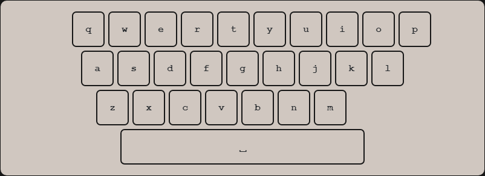

# typeTyper
#### Video Demo:  https://www.youtube.com/watch?v=GP7Ce5vA934
#### Description:

A website that measures your typing speed in WPM (words per minute) and keep track of your results.

>### ***Note:***
>*The goal of this website is to practice your keyboard typing skills specifically on touch typing that is why there is a keyboard model on the home page for you to know what key you are pressing and to familiarize on the position of each letter keys on the keyboard.*

You need to create an account in typeTyper to start practicing your typing and for you to record your results. After loggin in your account, you will be redirected to the home page. Typing on the keyboard automatically focuses on the input field and triggers the timer to start counting.

>### ***Tip:***
>***Tab + Enter** to quickly reset the timer and to get a new set of words*

After completing all the provided words, a modal will pop up with your results in WMP and a button to continue to the next session.

It also has a stats page where your record are stored, with the first row as your latest typing result.

## **Project Components:**

- ### **templates folder**
  - The templates folder contains the html files or the pages of the website.

  1. **layout.html**

      The layout.html contains the layout of the web application. The head contains the meta tags, the link and script of bootstrap to access its plugins and components, and the title with Jinja syntax to make the ttab title dynamic. The body contains three main parts, the navbar, the main, and the footer.

      The navbar is a bootstrap component and contains the title of the application and acts as the logo and portal to the home page, the stats for the records' page, and the login/register/logout where login and register also have separate pages.

      The main that is also with Jinja syntax to make the app dynamic. It can display the home page, the stats page, the login page, the registration page, and also the apology page for errors.

      The footer that contains the name of the developer and the year the web application was created.

  2. **index.html**

      The index.html contains the main part and frontend logic of the web application. It is divided into six parts, the timer, the texts, the input field, the keyboard model, the reset button, and the pop-up modal that is hidden as default.

      - **Timer** - The timer at default is "00.00" and shows the time of how many seconds have passed since the user had started typing.

      - **Texts** - The texts contains an n number of random generated words.

      - **Input field** - The input field is where the user types the words that is shown on the page.

      - **Keyboard model** - The keyboard that contains 26 letters of the alphabet and a spacebar. It shows the user what letter keys are being pressed on the actual keyboard.

      - **Reset button** - The reset button that when clicked reset the timer to "00.00" and generate a new set of n number of random generated words.

      - **Pop-up modal** - The pop-up modal only shows when the user finishes typing all the given words and shows the typing speed in words per minute. It also has a button to continue to the next typing session.

      It also contains the JavaScript of the home page. The script is set to defetr to render all the html and css first before executing any of the JavaScript.

      It first declares a variable named `common` that contains an array of the top 1000 most common English words.

      The `getRandomInt` is a function that returns a random integer that accepts an integer as the max random value.

      The `numOfWords` variable stores the number of words to be produced.

      The `createTextArray` function accepts an integer, in this case, the `numOfWords` to create an array of random words with `numOfWords` count.

      The `createdTextArray` is a variable that stores an array of random generated words with `numOfWords` count.

      The `stringTextArray` function accepts an array of strings and returns it in a single string.

      The `testText` variable is set to the Texts element where its innerText property will be set to `stringTextArray`.

      The `textInput` variable is set to the input element.

      The `isStart` variable which is false by default monitors if the user started typing.

      The `isShowModal` variable which is false by default monitors when the modal is showing.

      The `keyPress` function handles the keydown event. It starts with an if statement where if the modal is showing, no input will be registered. The next if statement is if the user is focused on the reset button where if the user press **Enter**, the reset button will be pressed or else nothing happens. The next if statement is if the user starts with the any but the **Tab** button and if `isStart` is false, the timer starts. The timer is a setInterval function that accepts two arguments, the `startTimer` function and the interval in milliseconds which is 10 milliseconds. And then change the `isStart` varible to true and focuses the input field on the webpage. Every letter key stroke on the keyboard applies a style effect to indicate a pressed button. The last if statement check if the inputted word matches the first word on the current Texts where if it is true removes the first word on the Texts.

      The `keyPressed` function handles the keyup event. It starts with an if statement where if the modal is showing, no input will be registered. It restores the original style of the model keyboard’s keys on the keyup.  It also checks if the last word matches the inputted word so it can stop the timer, reset the states, and show the modal where the session’s result is.

      Next is the timer where it tracks the time it takes the user to type all the words in the Texts.

      The `restButton` variable is set to the reset button element. Where when clicked or pressed will reset the timer to “00.00” and creates a new array of generated random words thus producing a new string of words.

  3. **login.html**

      The default page when there is no account logged in. It contains two input fields for the username and password, and the log in button.

  4. **register.html**

      The register page is where the user registers a new account. It contains three input fields for the username, password, and confirmation password, and a register button. It requires the user to input a unique username and a password that contains a combination of letters and numbers.

  5. **stats.html**

      The stats page that contains a table styled by bootstrap with the logged in accounts typing results. It renders the data by iterating each row of the user’s results divided by the columns for username, WPM, and date.

  6. **apology.html**

      The apology page catches the unintended behavior of the web application. it uses a meme generator that displays a cat varying texts depending on the error.

- ### **static folder**
  - The templates folder contains the html files or the pages of the website.
  1. **styles.css**

      Contains the css styles of the web application.

- ### **helpers.py**
  - The helpers.py contains the functions used in app.py. It contains two functions, the `apology` and `login_required`. The `apology` function is for handling error and renders a message to the user while the `login_required` checks if the user is logged in.

- ### **app.py**
  - The app.py handles the backend of the web application. The functions in the helpers.py are imported in this file. It handles the different actions sent by the user.  Every route has the `login_required` except for “/login” and “/register”.

    The route “/” is for the home page of the website.

    The route “/login” is for the login page. It comes with the `login` function that handles the login form. It checks if the user provided all the required credentials, if the username exists in the database, and if so uses the `check_password_hash` function imported from `werkzeug.security` to match the password by the user. If all the criteria are met, then the user will be logged in and redirected to the home page.

    The route “/logout” handles the action when the user clicked the logout button in the navbar.

    The route “/register” is for the register page. It comes with the `register` function that handles the register form. It checks if the user provided all the required credentials, if the username already exists, if the passwords does not match, and if the password is not a combination of letters and numbers. If all the criteria are met, then the user successfully registered an account will be redirected to the login page.

    The route “/submit” handles the action when the user completes and continues a session. It saves the result of the last typing session and the date in the database.

    The route “/stats” is for the stats page. It redirects the user to the stats page where all the records the account logged in is shown in a table.

- ### **typeTyper.db**
  - The typeTyper.db contains the database of the application. It has two tables, the `users` and the `stats`. The users table have three columns, the `id`, the `username`, and the `hash` for the password. The stats table have four columns, the `id`, the `user_id`, the `result`, and the `date`.

- ### **assets**
  - ### **images**
    - typeTyper.png - keyboard image
